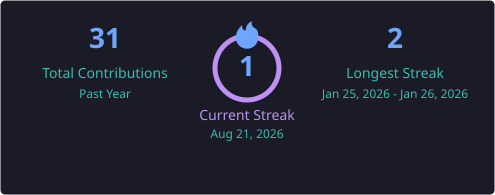

<!-- Banner -->
<p align="center">
  
</p>

<p align="center">
  
</p>

<p align="center">
  
  
  
</p>

---

# 💫 About Me

```yaml
Name: Mayur Tamanke

Education: B.E. Electronics & Telecommunication Engineering

Experience:
  - Cognizant Intern (MuleSoft & API Development)

Current Focus:
  - Agentic AI
  - Full Stack Development
  - AI Automation

Location: India 🇮🇳
```

> _"I love turning ideas into intelligent applications that solve real-world problems."_

---

# 🌐 Connect With Me

<p align="center">
  <a href="mailto:mayurtamanke9423@gmail.com">
    
  </a>
  <a href="https://www.linkedin.com/in/mayur-tamanke-8726a7283">
    
  </a>
  <a href="https://x.com/mayurtamanke">
    
  </a>
  <a href="https://my-portfolio-eight-wheat-23.vercel.app/">
    
  </a>
</p>

---

# 💻 Tech Stack

### Languages

<p>
  
</p>

### Frontend

<p>
  
</p>

### Backend

<p>
  
</p>

### Tools

<p>
  
</p>

---

# 🚀 Featured Projects

### 🎓 Advanced Attendance System using BLE & Geofencing

> **Final Year Project**

- 📍 BLE + Geofencing based smart attendance
- 📶 Raspberry Pi 3B+ classroom detection
- 📱 Android application for students
- 🌐 React + Node.js teacher dashboard
- ☁ MongoDB database & CSV export

---

### 🤖 SmartDraw AI

AI-powered calculator using **Google Gemini Vision** to solve handwritten mathematical expressions.

**Tech:** React • Node.js • Gemini Vision

---

### 🏆 Switches in the Air

Award-winning **AR + IoT Home Automation** project.

🥇 **1st Prize — Techspire 2025**

---

### 💧 Automatic Water Pump

IoT irrigation system with Firebase real-time monitoring using ESP8266.

---

### ⚡ Agentic AI Journey

Daily Python & AI automation projects documenting my journey into Agentic AI.

---

# 📊 GitHub Analytics

<p align="center">
  
  
</p>

<p align="center">
  
</p>

---

# 🏆 Achievements

<p align="center">
  
</p>

---

# 🎯 Current Learning

| Technology       | Progress       |
| ---------------- | -------------- |
| 🤖 Agentic AI    | █████████░ 90% |
| ☕ Java + Spring | ████████░░ 85% |
| ⚛ React + Node   | █████████░ 88% |
| 🐍 Python        | █████████░ 90% |

---

<p align="center">
  
</p>
